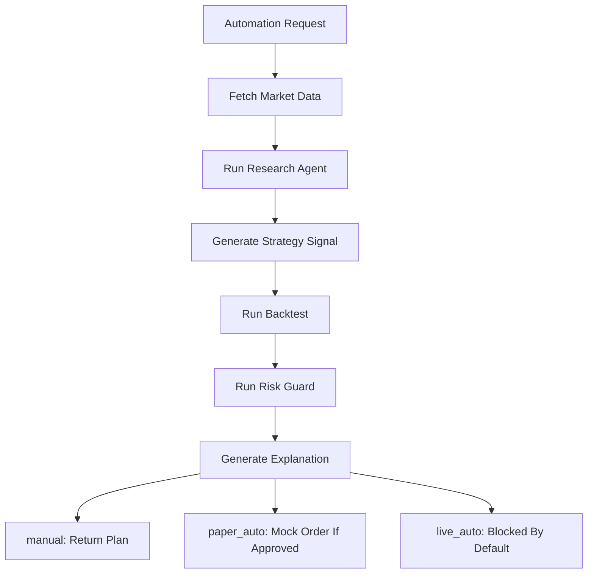

# AlphaMesh Architecture

AlphaMesh MVP 采用 API-first 后端架构，核心目标是清晰划分模块边界，便于后续接入真实行情、研究 Agent、策略引擎和券商适配器。

## 模块边界

- `api`: FastAPI 路由层，只负责请求响应和 schema 绑定。
- `schemas`: Pydantic API 数据结构。
- `domain`: 领域枚举和轻量领域模型。
- `services.market`: 外部平台 Skill 的统一抽象，MVP 仅实现 `MockSkillProvider`。
- `services.research`: 研究 Agent 抽象，默认通过 LLM Research Agent 和 Mock LLM Provider 生成结构化研报。
- `services.strategy`: 策略信号生成，包含均线交叉和估值区间示例。
- `services.backtest`: 简单回测引擎与指标计算。
- `services.risk`: 订单和策略风控规则。
- `services.explain`: 模板化信号解释。
- `services.automation`: 串联完整投研和执行流程。
- `services.broker`: 券商适配层，MVP 仅提供 mock/paper 交易，并持久化 paper order 便于演示追踪。
- `services.llm`: LLM Gateway，封装 Mock、OpenAI-compatible、Anthropic、Gemini 等 provider。
- `services.agents`: Agent Runtime 和只读 Tool Registry，用于把 LLM 输出校验成领域 schema。
- `services.agents.run_logger`: 记录 research 和 automation 的 Agent Run 日志，便于调试和审计。

## Automation Flow

## 扩展点

真实平台接入应实现 `MarketSkillProvider` 或 `BrokerAdapter`，并通过配置或依赖注入切换。MVP 中所有真实平台 Provider 均保留空壳并抛出 `NotImplementedError`。

LLM 接入应实现 `LLMProvider` 或复用 LangChain provider 封装。默认 `mock` provider 不需要 API key；真实模型 key 只能通过本地 `.env` 注入，不能提交到仓库。LLM Agent 第一阶段只用于研究报告生成，不允许绕过 `RiskGuard` 或直接触发真实交易。
