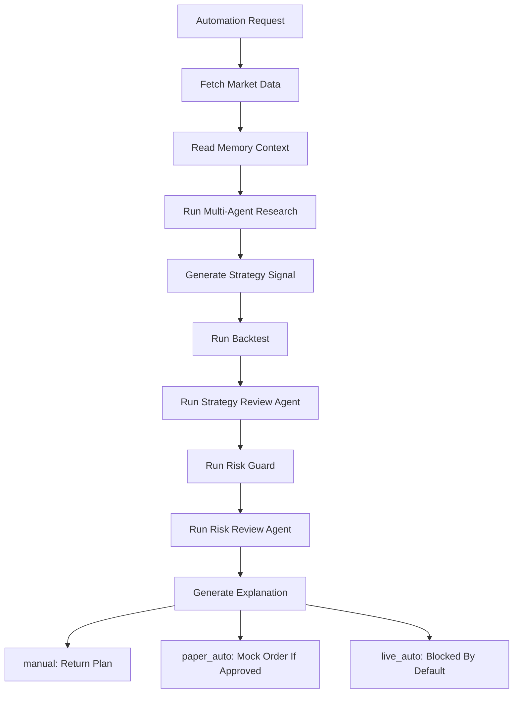
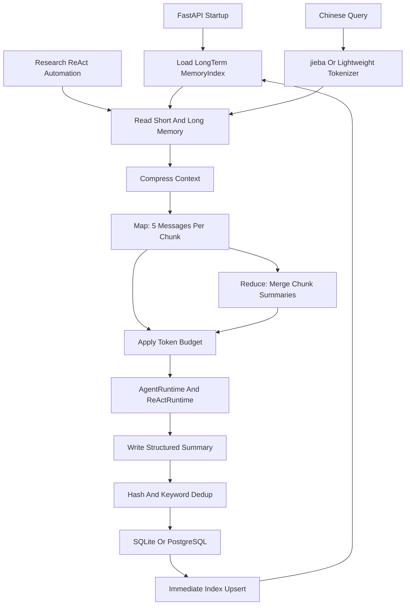

# AlphaMesh Architecture

AlphaMesh MVP 采用 API-first 后端架构，核心目标是清晰划分模块边界，便于后续接入真实行情、研究 Agent、策略引擎和券商适配器。

## 模块边界

- `api`: FastAPI 路由层，只负责请求响应和 schema 绑定。
- `schemas`: Pydantic API 数据结构。
- `domain`: 领域枚举和轻量领域模型。
- `services.market`: 外部平台 Skill 的统一抽象，MVP 仅实现 `MockSkillProvider`。
- `services.research`: 研究 Agent 抽象，默认通过多 Agent workflow 和 Mock LLM Provider 生成结构化研报。
- `services.strategy`: 策略信号生成，包含均线交叉和估值区间示例。
- `services.backtest`: 简单回测引擎与指标计算。
- `services.risk`: 订单和策略风控规则。
- `services.explain`: 模板化信号解释。
- `services.automation`: 串联完整投研和执行流程。
- `services.broker`: 券商适配层，MVP 仅提供 mock/paper 交易，并持久化 paper order 便于演示追踪。
- `services.llm`: LLM Gateway，封装 Mock、OpenAI-compatible、Anthropic、Gemini 等 provider。
- `services.agents`: Agent Runtime、只读 Tool Registry 和 `MultiAgentResearchWorkflow`，用于把多角色 LLM 输出校验成领域 schema。
- `services.memory`: 短期记忆、长期记忆、中文轻量分词、内存关键词索引、Map-Reduce 上下文压缩和 Token 预算管理，用于给 Agent 注入受控上下文。
- `services.llm.call_logger`: 记录每次 LLM 调用的 prompt、completion 和 total token 消耗。
- `services.agents.run_logger`: 记录 research 和 automation 的 Agent Run 日志，便于调试和审计。

## Automation Flow

## Memory System

Memory 只增强上下文，不改变交易权限。短期记忆保存最近运行、工具轨迹和对话摘要；长期记忆保存偏好、投研摘要和关键风险。长期记忆使用规范化内容哈希做精确去重，使用关键词 Jaccard 相似度做近似去重，服务启动时加载到内存索引，写入后立即刷新索引。上下文 token 估算超过总预算 80% 时触发 Map-Reduce 压缩，Map 每 5 条旧消息一组，Reduce 合并多个摘要；只有一组时不做 Reduce。第一版不引入外部向量数据库，也不保存真实交易凭证或真实账户信息。

## 扩展点

真实平台接入应实现 `MarketSkillProvider` 或 `BrokerAdapter`，并通过配置或依赖注入切换。MVP 中所有真实平台 Provider 均保留空壳并抛出 `NotImplementedError`。

LLM 接入应实现 `LLMProvider` 或复用 LangChain provider 封装。默认 `mock` provider 不需要 API key；真实模型 key 只能通过本地 `.env` 注入，不能提交到仓库。多 Agent 和 Memory 仅用于投研辅助、策略复核和风控复核，不允许绕过 `RiskGuard` 或直接触发真实交易。
